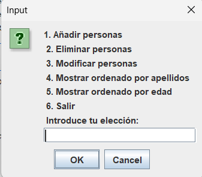
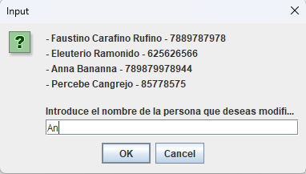
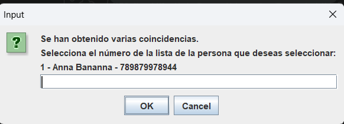
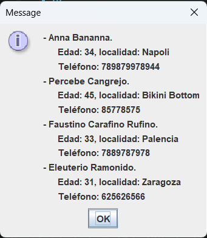

# Agenda

Aplicación de escritorio de agenda de contactos telefónicos desarrollada con Java.

El proyecto fue creado originalmente como trabajo final de la asignatura de programación de 1º de DAW. Posteriormente realicé algunos cambios que hacían la experiencia de usuario más cómoda y realista. También lo refactoricé para para mejorar la arquitectura, separando la lógica de la agenda de la interfaz de usuario.

Los contactos son guardados en un fichero binario, de manera queda almacenada en diferentes ejecuciones.

## Funcionalidades

- Añadir nuevos contactos
- Editar contactos existentes
- Eliminar contactos
- Búsqueda por nombre y/o apellidos
- Generación automática de IDs
- Persistencia de datos en fichero binario
- Ordenación por apellidos
- Ordenación por edad
- Validación de entradas y control de errores

## Tecnologías
- Java
- Java Swing (JOptionPane)
- Programación Orientada a Objetos (POO)
- Ficheros binarios
- Git

## Estructura del proyecto

src/
 ├── Agenda.java              // Lógica de negocio
 ├── AgendaUI.java            // Interfaz de usuario
 ├── Persona.java             // Modelo de datos
 ├── GestionArchivos.java     // Gestión de ficheros binarios
 └── Main.java

## Screenshots
### Menú principal

### Búsqueda de contactos

### Modificar contacto

## Mejoras futuras
- Sustituir los diálogos de JOptionPane por una interfaz gráfica completa con Swing.
- Añadir filtros de búsqueda avanzados.

## Pruebas

Pruebas realizadas manualmente para verificar el correcto funcionamiento de las funcionalidades principales:

| Funcionalidad                             | Probada |
|-------------------------------------------|---------|
| Añadir contacto                           | ✅     |
| Eliminar contacto                         | ✅     |
| Modificar contacto                        | ✅     |
| Búsqueda por nombre                       | ✅     |
| Búsqueda por apellidos                    | ✅     |
| Búsqueda combinada                        | ✅     |
| Nombres duplicados                        | ✅     |
| Persistencia al reiniciar                 | ✅     |
| Validación de tipos de datos introducidos | ✅     |

## Nota

Proyecto originalmente desarrollado como práctica académica y posteriormente mejorado de forma personal para reforzar buenas prácticas de diseño y mantenimiento de código.